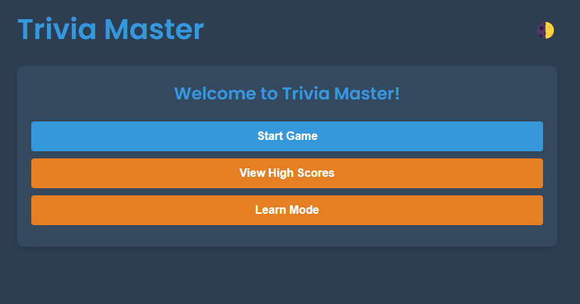
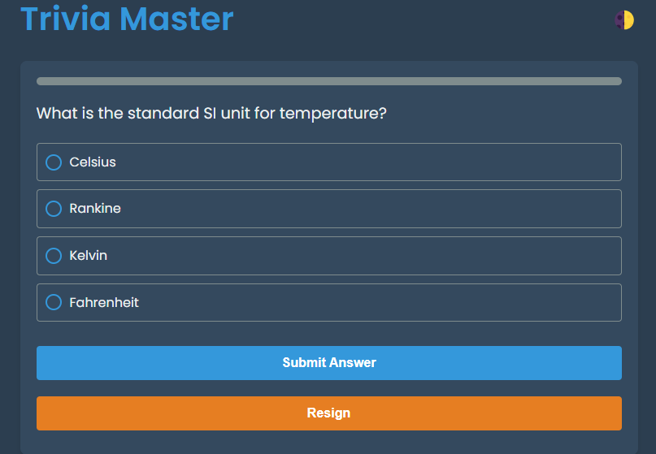
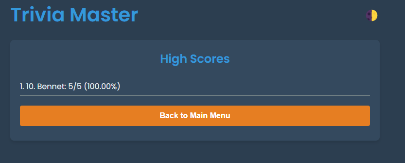

# Trivia Master

Trivia Master is an engaging web-based trivia game designed to test your knowledge across various categories and difficulty levels.

## Features

- **Customizable Gameplay**: Choose from different categories, difficulty levels, and number of questions.
- **Score Saving**: Save your score with your name and view the high scores leaderboard.
- **Learn Mode**: Review questions and answers without the pressure of scoring.
- **Theme Toggle**: Switch between dark and light themes for a comfortable viewing experience.

## Screenshots





## Technologies Used

- HTML, CSS, JavaScript
- Fetch API for data retrieval from the Open Trivia Database
- Local Storage for caching questions and saving high scores

## Setup

1. **Clone the repository:**

   ```bash
   git clone https://github.com/your-username/trivia-master.git
   ```

2. **Navigate to the project directory:**

   ```bash
   cd trivia-master
   ```

3. **Open `index.html` in your web browser:**

   ```bash
   open index.html
   ```

## How to Play

1. **Main Menu**: Choose to start a new game, view high scores, or enter learn mode.
2. **Game Setup**: Select a category, difficulty, and the number of questions, then click "Start Game".
3. **Gameplay**: Answer each question presented. Progress is tracked with a progress bar.
4. **End Game**: After answering all questions, view your score and review any incorrect answers.
5. **Learn Mode**: Study questions and correct answers without being scored.

## Contributing

We welcome contributions! To contribute:

1. Fork the repository.
2. Create a new branch (`git checkout -b feature-branch`).
3. Make your changes.
4. Commit your changes (`git commit -m 'Add some feature'`).
5. Push to the branch (`git push origin feature-branch`).
6. Open a pull request.

## Author

- **Bennet Nkolele** - Initial work - [GitHub](https://github.com/Benighter)

## License

This project is licensed under the MIT License. See the [LICENSE](LICENSE) file for details.

---
